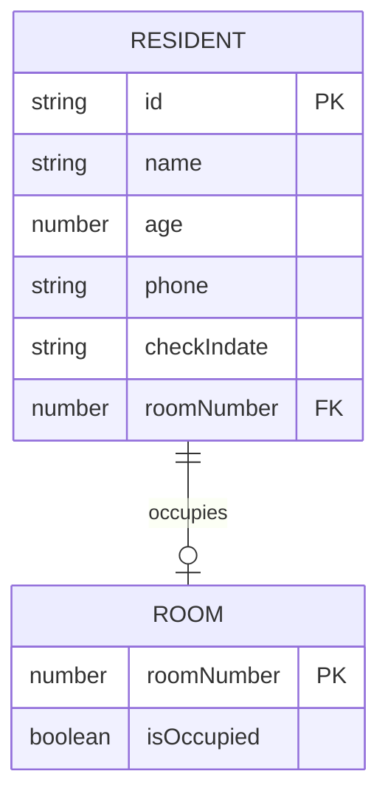

The Hostel Management System uses TypeScript interfaces to define the shape of data throughout the application. This ensures type safety and provides clear contracts for data structures.

## Core interfaces

Two primary interfaces define the data model:

<Tabs>
  <Tab title="Resident">
    The `Resident` interface represents a person staying at the hostel.
    
    ```typescript
    export interface Resident{
        id:string;
        name:string;
        age:number;
        phone:string;
        checkIndate:string;
        roomNumber : number;
    }
    ```
    
    Defined in `src/model/residents.ts`
  </Tab>
  
  <Tab title="Rooms">
    The `Rooms` interface represents a room and its occupancy status.
    
    ```typescript
    export interface Rooms{
        roomNumber : number;
        isOccupied : boolean;
    }
    ```
    
    Defined in `src/model/rooms.ts`
  </Tab>
</Tabs>

## Resident interface

The `Resident` interface is the core entity representing hostel guests.

### Properties

<ParamField path="id" type="string" required>
  Unique identifier for the resident. Generated using `Date.now().toString()` to ensure uniqueness.
</ParamField>

<ParamField path="name" type="string" required>
  Full name of the resident.
</ParamField>

<ParamField path="age" type="number" required>
  Age of the resident in years.
</ParamField>

<ParamField path="phone" type="string" required>
  Contact phone number for the resident.
</ParamField>

<ParamField path="checkIndate" type="string" required>
  Date when the resident checked in. Stored as a string in the format selected by the HTML date input.
</ParamField>

<ParamField path="roomNumber" type="number" required>
  The room number assigned to this resident. Must correspond to a valid room number in the `Rooms` array.
</ParamField>

### Usage example

Here's how a new resident is created in the service layer:

```typescript
const newResident: Resident = {
  id: Date.now().toString(),
  name: name,
  age: age,
  phone: phone,
  roomNumber: roomNumber,
  checkIndate: checkInDate,
};
this.resident.push(newResident);
```

See `src/services/hostelService.ts:58` for the implementation.

<Note>
The `id` field uses timestamp-based generation. In a production system, you might want to use UUID or a database-generated ID for better uniqueness guarantees.
</Note>

### Partial updates

The system supports partial updates using TypeScript's `Partial<T>` utility type:

```typescript
updateResident(residentId: string, updatedData: Partial<Resident>) {
  const index = this.resident.findIndex((r) => r.id === residentId);
  if (index === -1) throw new Error("Resident not found");

  const oldResident = this.resident[index];
  // ... room reassignment logic if needed ...
  this.resident[index] = { ...oldResident, ...updatedData };
  this.saveData();
}
```

This allows updating any subset of resident properties without requiring all fields. See `src/services/hostelService.ts:89`.

## Rooms interface

The `Rooms` interface represents individual rooms and their availability status.

### Properties

<ParamField path="roomNumber" type="number" required>
  Unique room number. In the default configuration, rooms are numbered 101-110.
</ParamField>

<ParamField path="isOccupied" type="boolean" required>
  Indicates whether the room is currently occupied. `true` means a resident is assigned to this room, `false` means it's vacant.
</ParamField>

### Initial room data

The system initializes with 10 rooms, all vacant:

```typescript
import { Rooms } from "../model/rooms"
export const roomsAvailability : Rooms[] = [
    {roomNumber:101,isOccupied:false},
    {roomNumber:102,isOccupied:false},
    {roomNumber:103,isOccupied:false},
    {roomNumber:104,isOccupied:false},
    {roomNumber:105,isOccupied:false},
    {roomNumber:106,isOccupied:false},
    {roomNumber:107,isOccupied:false},
    {roomNumber:108,isOccupied:false},
    {roomNumber:109,isOccupied:false},
    {roomNumber:110,isOccupied:false},
];
```

Defined in `src/data/roomsData.ts:2`.

<Info>
To add more rooms to the system, simply add additional room objects to the `roomsAvailability` array. The system will automatically incorporate them on first load.
</Info>

### Room state management

Room occupancy is automatically managed by the service layer:

<Tabs>
  <Tab title="Check-in">
    When a resident is added, their assigned room is marked as occupied:
    
    ```typescript
    const room = this.rooms.find((r) => r.roomNumber === roomNumber);
    if (!room) {
      throw new Error("Room doesn't exist");
    } else if (room.isOccupied) {
      throw new Error("Room is already occupied");
    }
    // ... create resident ...
    room.isOccupied = true;
    this.saveData();
    ```
    
    See `src/services/hostelService.ts:51`
  </Tab>
  
  <Tab title="Check-out">
    When a resident is removed, their room is marked as vacant:
    
    ```typescript
    const room = this.rooms.find(
      (r) => r.roomNumber === this.resident[index].roomNumber,
    );
    if (!room) {
      throw new Error("Room doesn't exist");
    }
    room.isOccupied = false;
    this.resident.splice(index, 1);
    this.saveData();
    ```
    
    See `src/services/hostelService.ts:78`
  </Tab>
  
  <Tab title="Room change">
    When a resident changes rooms, both old and new rooms are updated:
    
    ```typescript
    if (
      updatedData.roomNumber &&
      updatedData.roomNumber !== oldResident.roomNumber
    ) {
      const newRoom = this.rooms.find(
        (r) => r.roomNumber === updatedData.roomNumber,
      );
      if (!newRoom || newRoom.isOccupied)
        throw new Error("New room unavailable");

      const oldRoom = this.rooms.find(
        (r) => r.roomNumber === oldResident.roomNumber,
      );
      if (oldRoom) oldRoom.isOccupied = false;

      newRoom.isOccupied = true;
    }
    ```
    
    See `src/services/hostelService.ts:95`
  </Tab>
</Tabs>

<Warning>
The system prevents double-booking by validating room availability before assignment. Attempting to assign an occupied room will throw an error.
</Warning>

## Data relationships

The relationship between residents and rooms is maintained through the `roomNumber` field:



- Each resident must reference exactly one valid room number
- Each room can be occupied by at most one resident
- The `isOccupied` flag is derived from the existence of a resident with that `roomNumber`

## Storage format

Both interfaces are serialized to JSON for localStorage persistence:

```typescript
// Stored in localStorage under key "rooms"
[
  {"roomNumber":101,"isOccupied":false},
  {"roomNumber":102,"isOccupied":true},
  // ...
]

// Stored in localStorage under key "residents"
[
  {
    "id":"1709472000000",
    "name":"John Doe",
    "age":25,
    "phone":"123-456-7890",
    "roomNumber":102,
    "checkIndate":"2024-03-01"
  },
  // ...
]
```

## Type safety benefits

Using TypeScript interfaces provides several advantages:

<CardGroup cols={2}>
  <Card title="Compile-time checks" icon="shield-check">
    TypeScript validates that all required properties are present and have correct types before the code runs.
  </Card>
  
  <Card title="IntelliSense support" icon="lightbulb">
    IDEs provide autocomplete and inline documentation for all interface properties.
  </Card>
  
  <Card title="Refactoring safety" icon="wrench">
    Renaming or modifying interface properties automatically highlights all usage locations.
  </Card>
  
  <Card title="Documentation" icon="book">
    Interfaces serve as self-documenting code that clearly communicates data structure expectations.
  </Card>
</CardGroup>

## Extending the data model

To add new properties to the data model:

1. Update the interface definition in `src/model/residents.ts` or `src/model/rooms.ts`
2. Update the service layer methods that create or manipulate the data
3. Update the UI layer to display or collect the new fields
4. Clear localStorage or provide migration logic to handle existing data

<Note>
When adding required fields, existing data in localStorage may become invalid. Consider making new fields optional initially or providing default values during data loading.
</Note>
